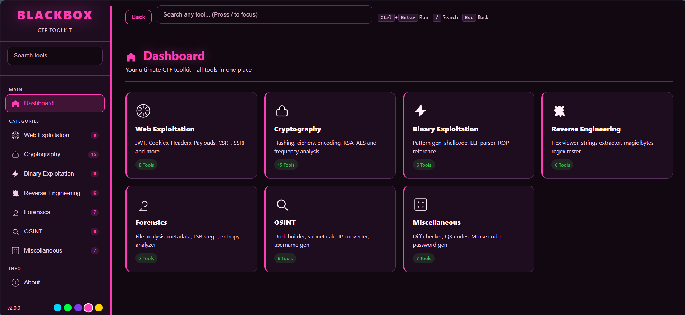
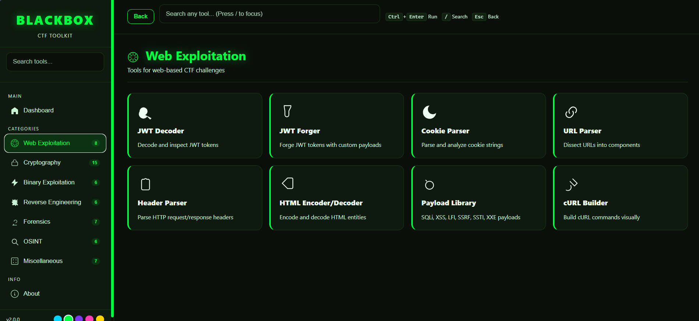
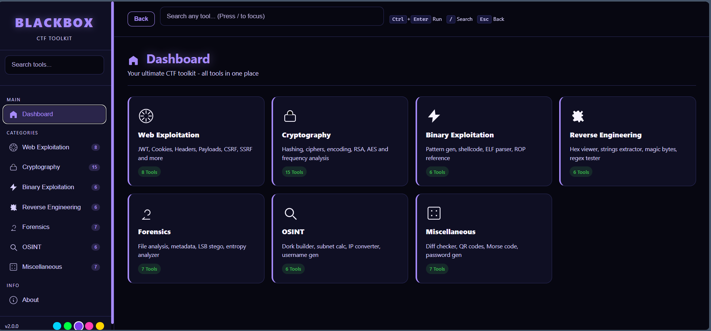
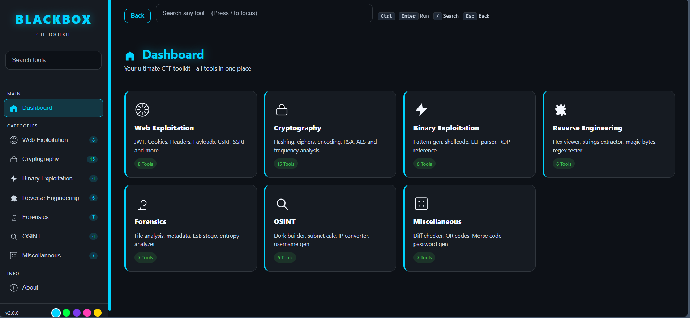
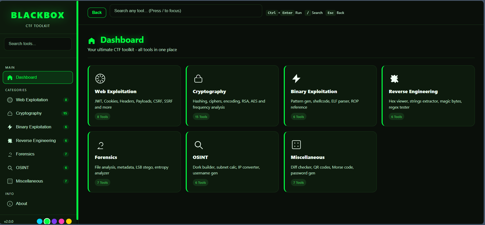
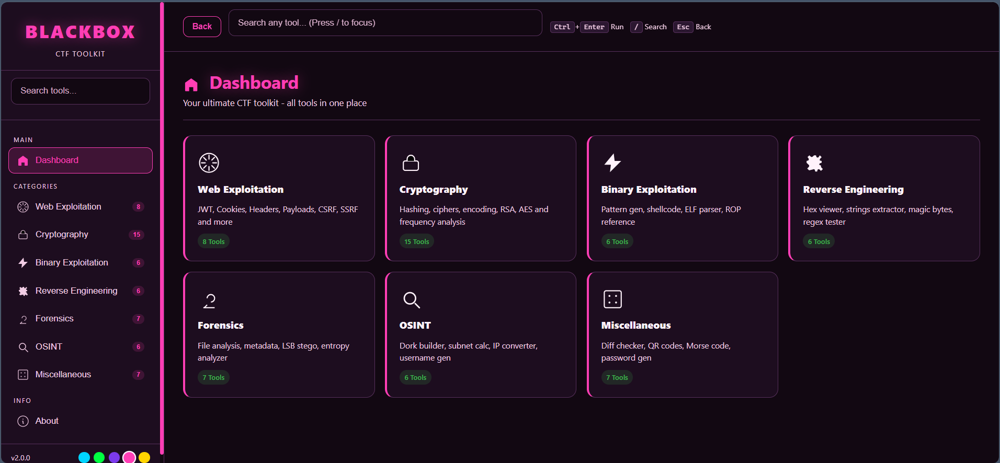
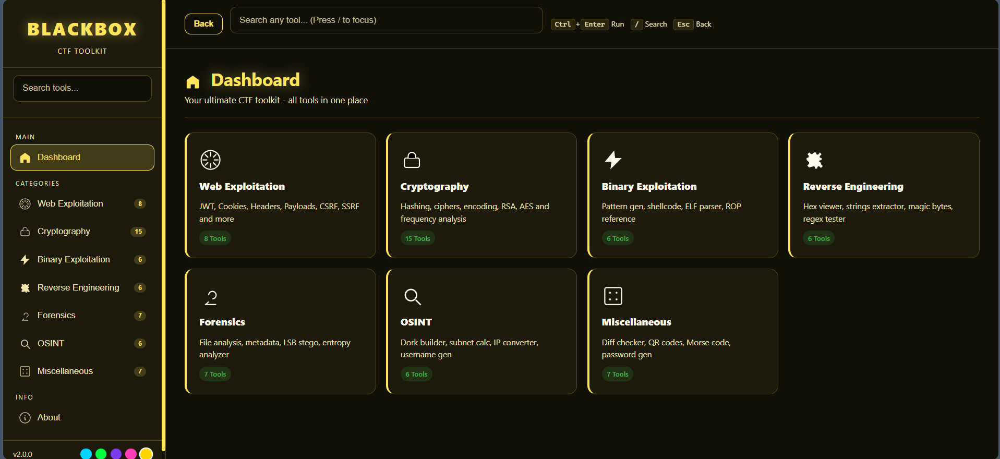

# BlackBox

BlackBox is a browser-based CTF toolkit for common web, crypto, reversing, binary, forensics, OSINT, and utility tasks. It is built with plain HTML, CSS, and JavaScript, so it can run locally without a backend.

## Screenshots

### Dashboard



### Category View



### Tool Panel


### Themes







## Features

- 55 tools across 7 CTF-focused categories.
- Global search for quickly opening tools.
- Sidebar category navigation.
- Multi-theme UI: Cyber, Hacker, Midnight, Pink, and Yellow.
- Back navigation between dashboard, category previews, and tool panels.
- Local wordlists for hash cracking.
- Client-side processing only; no backend service is required.

## Running Locally

The recommended way to run BlackBox is through the included local server:

```bash
node dev-server.js
```

Then open:

```text
http://127.0.0.1:8000/
```

Running through the local server is recommended because browser security rules can block local `fetch()` requests when opening `index.html` directly. Some tools, such as the Hash Cracker built-in wordlists, work best from the local server.

## Project Structure

```text
BlackBox/
  index.html              Main application markup and tool panels
  dev-server.js           Small local static file server
  css/
    base.css              Theme variables, reset, and base typography
    layout.css            App shell, sidebar, topbar, page layout
    components.css        Cards, buttons, inputs, tabs, outputs
    animations.css        UI animations
    responsive.css        Mobile and tablet layout rules
  js/
    app.js                Navigation, search, theme switching, tool registry
    global.js             Shared helpers, output helpers, copy/export utilities
    tools/
      web.js              Web exploitation tools
      crypto.js           Hashing, cracking, crypto helpers
      encoding.js         Encoding utilities
      ciphers.js          Cipher utilities
      binary.js           Binary exploitation tools
      reversing.js        Reverse engineering tools
      forensics.js        Forensics tools
      osint.js            OSINT tools
      misc.js             Miscellaneous utilities
  assets/
    libs/                 Browser-side third-party libraries
    wordlists/            Built-in wordlists for cracking and CTF workflows
    screenshots/          README screenshots
```

## Tool Categories

### Web Exploitation

- JWT Decoder
- JWT Forger
- Cookie Parser
- URL Parser
- Header Parser
- HTML Encoder/Decoder
- Payload Library
- cURL Builder

### Cryptography

- Hash Generator
- Hash Cracker
- Hash Identifier
- Encoder
- Decoder
- Caesar / ROT
- Vigenere Cipher
- XOR Tool
- Atbash Cipher
- Frequency Analyzer
- RSA Tool
- AES Tool
- Base Converter
- HMAC Generator
- ASCII Converter

### Binary Exploitation

- Pattern Generator
- Shellcode Encoder
- String / Hex
- ELF Header Parser
- ROP Reference
- Assembly Reference

### Reverse Engineering

- Hex Viewer
- Strings Extractor
- Magic Bytes ID
- Regex Tester
- JS Deobfuscator
- Disasm Reference

### Forensics

- Hex Dump
- Metadata Extractor
- LSB Stego Detector
- Entropy Analyzer
- PNG Chunk Analyzer
- File Hasher
- Forensics Reference

### OSINT

- Google Dork Builder
- Subnet Calculator
- IP Converter
- Username Generator
- Shodan Query Builder
- Email Format Guesser

### Miscellaneous

- Diff Checker
- Timestamp Converter
- QR Code Tool
- Morse Code
- Password Generator
- Wordlist Generator
- UUID Tool

## Navigation

- Use the sidebar to move between categories.
- Use the dashboard cards for category previews.
- Use the top search box to find any tool by name or description.
- Use the Back button, browser back button, or `Esc` to move back through the app history.

## Themes

Use the color dots in the sidebar footer to switch themes:

- Cyber
- Hacker
- Midnight
- Pink
- Yellow

Theme variables live in `css/base.css`. Component and layout styles consume those variables so colors remain consistent across the app.

## Wordlists

Built-in wordlists are stored in `assets/wordlists/`:

- `common-passwords.txt`
- `rockyou-mini.txt`
- `ctf-common.txt`

The Hash Cracker can also accept custom words from the text area or an uploaded `.txt` wordlist.

## Development Notes

- Tool cards and tool panels are declared in `index.html`.
- Tool builder functions live in `js/tools/*.js`.
- Tool IDs must be registered in `TOOL_BUILDERS` and `TOOL_NAMES` inside `js/app.js`.
- Shared helper functions should go in `js/global.js`.
- Keep user-facing text readable across every theme by using the CSS variables instead of hard-coded colors.
